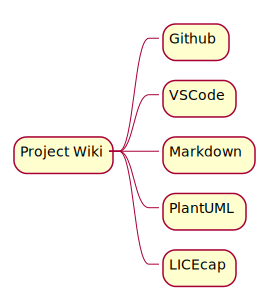

Test from bastion i-03ca
<div align="center">
    </img>

| <a href="#header">HEADER</a> 
| <a href="#emphasis">EMIOOOSIS</a> 

</div>
# Wiki Base
# BBQ
<a href="#archor">ARCHOR</a>

## Project

### Project Wiki



### Project Run


You can render UML diagrams using [Mermaid](https://mermaidjs.github.io/). For example, this will produce a sequence diagram:

```plantuml format="png" classes="uml myDiagram" alt="My super diagram placeholder" title="My super diagram" width="300px" height="300px"
  Goofy ->  MickeyMouse: calls
  Goofy <-- MickeyMouse: responds
```


And this will produce a flow chart:


### Archor

<div align="right">
    <b><a href="#----">↥ back to top</a></b>
</div>
